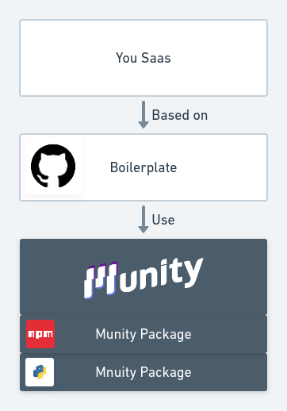

# How to use

## How to use Munity

* Munity is an open source fullstack framework so you can read all the source code here : https://github.com/munityapps/munity
* To use Munity **you need a boilerplate**



* A boilerplate is an already ready to use application that is plugged to Munity through packages.
  * Blank boilerplate : https://github.com/munityapps/blank_boilerplate
  * Backoffice, Dataviz and other boilerplate will come soon

## Get started

### Start Munity, the easy way

```shell
git clone https://github.com/munityapps/blank_boilerplate
cd blank_boilerplate
cp ./env.sample ./.env
./scripts/start.sh
```

You can access munity on [http://localhost:3000](http://localhost:3000)

### Start Munity step by step

**Get munity boilerplate**

```
git clone https://github.com/munityapps/blank_boilerplate
cd blank_boilerplate
```

**Start Munity services**

```
docker-compose up -d
```

**Create your database and migrate**

```
docker-compose exec db psql -U munityapps -c "create database munity"
docker-compose exec api python manage.py migrate
```

**Database is now available, restart API**
```
docker-compose restart api
```

**Create your first user**
```
docker-compose exec api python manage.py createsuperuser
```

**Start frontend**
```
cd app ; yarn install ; yarn start
```
