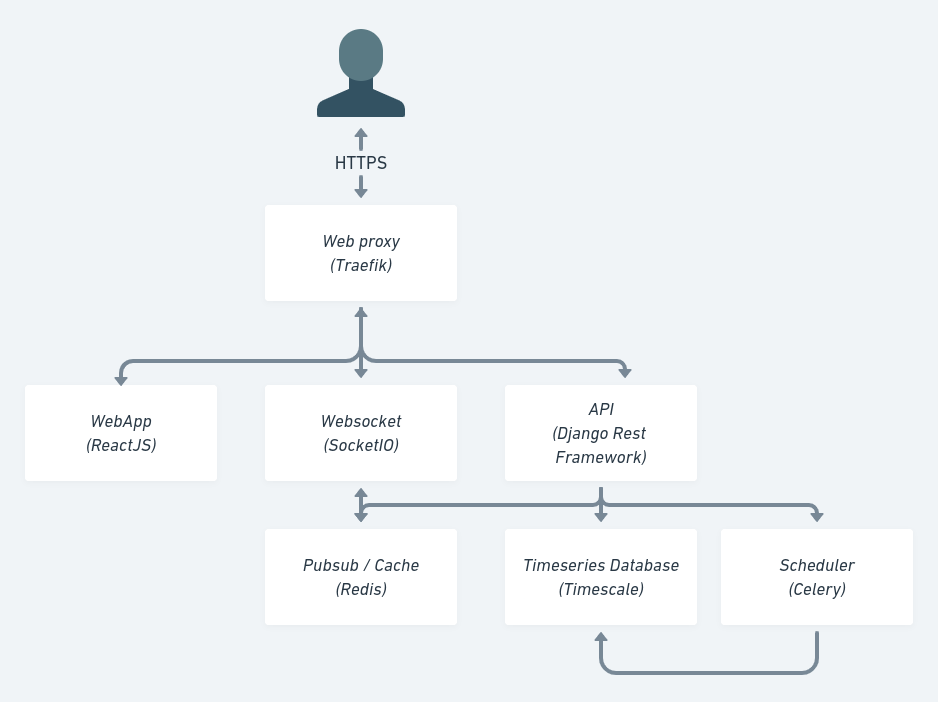

# Welcome to Munity documentation

## What is Munity

Munity is a platform to build your SaaS faster!

* Munity can handle many busness case
* Munity respects best design pattern and is based on famous open source software.
* Munity is higly customizable

Our goal :

* Accelerate all project based on data
* Focused on community, open source first
* Be the best modular platform on internet

## Architecture

{ align=left }

We use docker to work in local environment
We use kubernetes to deploy in production

Munity has 8 services :

- Web proxy
- Frontend
- Backend
- Timeseries/Relationnal database
- Data warehouse
- Scheduler (worker and beat)
- Pubsub and volatile database
- Websocket

### Web proxy
We choose ***Traefik*** as a proxy because it is really simple to use and powerful. Moreover, traefik works well with kubernetes.
The configuration through label (for docker) and charts (for kubernetes) remove the needs to build a configuration file. It is very convenient.

### Frontend
- We choose ***React*** with ***Timescript*** to build Munity frontend. We really like the component approch of React and the community built around.
- To manage application state we choose ***Redux***, easy to understand, visualize and debug.
- We choose ***Prime React*** to have a strong libraries of basic component and we like the theme approch to customise it.
- We add a translation system based on ***i18***
- We choose ***socket.io*** to manage websockets
- To test application we use :
    - Unit tests : ***Jest ***
    - End to end tests : ***Cypress ***
    - Score : ***Web vital***

### Backend
For backend we use ***Django rest framework*** for it simplicity and the very large range of features that the community provide.
Backend use ***JWT*** approch to manage user sessions.
To make functional test we use ***Newman*** from ***Postman*** to test all endpoints.

### Timeseries and relational database
***PostgresSQL*** has many interesting features, for exemple NoSQL embed in SQL Relationnal is a smart approch.
Since we work with Data, a timeseries database is a mandatory for performance and scalability, so we use the ***Timescale*** surcharge.

### Data warehouse
Data can be collected and stored directly in previous backend service. But we think it's a better approch to isolated data collected in a dedicated service.
To do so, we use ***FastAPI*** because it is very fast and simple to use. It is writted in Python as all backend services.

### Scheduler
Again, we search a python service to run the scheduler. Django recommand to use ***Celery*** so we implement it with redis as Pubsub event and result storage.
We use ***django celery beat*** to store scheduled task directly on database.

### Pubsub and volatile database
As said before, we choose ***Redis*** to sync Munity services togethere with observer pattern. It is also used to cache and to store volatile data.

### Websocket
To update client from server we add a websocket server. It is a simply ***NodeJS*** server with ***socket.io*** connected to redis Pubsub to forward event to clients over channal.

## How to start

* Use git clone

* Use docker-compose

* Use kubernetes
