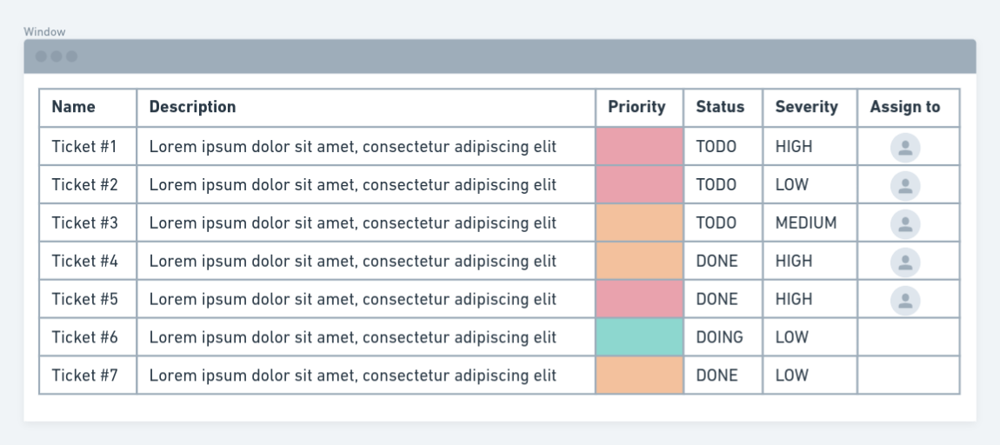

# How to add a new content !

Out of the box, boilerplate is a fully functionnable application but you want to add your custom data inside it.
We will take as an exemple a new `Ticket` model and implement it on frontend and backend.

**Exemple with tickets:**



## Backend part

First you need to create your new app that will be your Ticket app system.

```shell
$ docker-compose exec api python manage.py startapp tickets
```

That will create the following files :

    📦api/tickets
     ┣ 📂migrations         //-> dicrectory for your migration file, django take care of that <3
     ┣ 📜admin.py           //-> use for django admin
     ┣ 📜apps.py            //-> basic config file for this app
     ┣ 📜models.py          //-> new model used by your app
     ┣ 📜tests.py           //-> used for unitary test
     ┗ 📜views.py           //-> your viewset / serializer of your app will be here

You only want to adapt your model `models.py` and your view/serializer `views.py`.

In munity data are splitted around workspaces and can also be groupable. Munity take care of that.

To manage `Tickets` in our application we can modify our models to match following :

**models.py**
```python
from django.db import models
from munity.models import MunityModel, MunityGroupableModel
from munity.users.models import User
from django.db.models.deletion import SET_NULL


# Below we say two things :
#    - Ticket are a Munity model, that's mean it is related to workspaces, it is timesteamped, and has an UUIDv4 for id.
#    - Ticket are a Munity groupable model, that's mean they can be grouped
class Ticket(MunityModel), MunityGroupableModel:
    class TicketStatus(models.TextChoices):
        TODO        = 'TODO', 'TODO'
        DOING       = 'DOING', 'DOING'
        DONE        = 'DONE', 'DONE'
    class TicketSeverity(models.TextChoices):
        HIGH        = 'H', 'Hight'
        MEDIUM      = 'M', 'Medium'
        LOW         = 'L', 'Low'
    class TicketPriority(models.TextChoices):
        IMPORTANT   = "red", 'Important'
        NORMAL      = "orange", 'Normal'
        TRIVIAL     = "green", 'Trivial'

    name = models.CharField(max_length=256, blank=False, null=False)
    description = models.TextField(blank=True, null=True)
    # Use a foreign key ot refer user
    assign_to = models.ForeignKey(User, related_name='assign_to_users', on_delete=SET_NULL, blank=True, null=True)
    status = models.CharField(
        choices=TicketStatus.choices,
        default=TicketStatus.TODO,
    )
    severity = models.CharField(
        choices=TicketSeverity.choices,
        default=TicketSeverity.TODO,
    )
    priority = models.CharField(
        choices=TicketPriority.choices,
        default=TicketPriority.TODO,
    )
    serializer_class = LaboratorySerializer
```

Then adapt your `views.py` :

```py
from rest_framework import serializers
from .models import Ticket
from munity.views import MunityWorkspaceViewSet

class TicketSerializer(serializers.ModelSerializer):
    class Meta:
        fields = '__all__'
        model=Ticket
    # expend user to get all user information on tickets
    assign_to = UserSerializer()

class TicketViewSet(MunityWorkspaceViewSet):
    serializer_class = TicketSerializer
```

## Create database table

Thanks to Django this part is crazy easy :

```shell
$ docker-compose exec api python manage.py makemigration tickets
$ docker-compose exec api python manage.py migrate
```


## Manage right for new model

By default your users cannot access your new model, you have to add permissions.

Munity provide a CLI to care of that for you. It will give read only access to user and full access to Admin and Owner.

This command will create `Permissions` :
- list ticket
- update ticket
- create ticket
- delete ticket
- retreive ticket

And give access to *list* and *retrieve* to **User** role and all `Permissions` to **Admin**/**Owner**

```shell
$ docker-compose exec api python manage.py initiate_default_authorization
```


Permissions works as following :

This exemple show how **John** access  workspace **foo** as an **User** so it can **list users**.


## Frontend part

On previous part we create and give access to following endpoints :

- **GET** `https://api.*DOMAIN_NAME*/tickets/` to get all tickets
- **POST** `https://api.*DOMAIN_NAME*/tickets/` to create new ticket
- **PATCH** `https://api.*DOMAIN_NAME*/tickets/*uuid*/` to update specific ticket
- **DELETE** `https://api.*DOMAIN_NAME*/tickets/*uuid*/` to delete specific ticket

Munity frontend app provide a tool to link directly these enpoint to a store.

1. Create a new slice, for exemple in `app/tickets/slice.tsx`.

2. Add following code inside:

```typescript
import { sliceFactory } from 'munityapps/factory/slice';

export enum TicketStatus{ TODO = "TODO", DOING = "DOING", DONE = "DONE" }
export enum TicketSeverity { HIGH = "H", MEDIUM = "M", LOW = "M" }
export enum TicketPriority { IMPORTANT = "red", NORMAL = "Normal", TRIVIAL = "Trivial" }

export interface Ticket{
    id: string,
    name: number,
    description: string,
    status: TicketStatus,
    severity: TicketSeverity,
    priority: TicketPriority,
    created: Date,
    updated: Date,
}

export const ticketAPISlice = sliceFactory<Ticket>({
    reducerName: 'ticketAPI',
    endpoint: '/tickets/',
    name: 'Ticket'
});


export const {
    useGetTicketsQuery,
    useGetTicketQuery,
    useDeleteTicketMutation,
    useUpdateTicketMutation,
    useCreateTicketMutation,
} = ticketAPISlice
```

3\. Add your slice to your store in `app/store.ts`

```typescript
import { configureStore } from '@reduxjs/toolkit'

import { munityMiddleware, munityReducer } from 'munityapps/store';
import { ticketAPISlice } from './tickets/slice';
// [...]

// munityReducer[storeKey] = reducer;
munityReducer[ticketAPISlice.reducerPath] = ticketAPISlice.reducer;
// [...]

// munityMiddleware.push(middleware);
munityMiddleware.push(ticketAPISlice.middleware);
// [...]

const store = configureStore({
    reducer: munityReducer,
    middleware: getDefaultMiddleware =>
        getDefaultMiddleware()
            .concat(munityMiddleware)
    })

export default store;
```

4\. Now you can use your new component anyware in your application :

```typescript
import './style.scss';
import TicketTable from './list';
import { useGetTicketsQuery, User } from './slice';

const TicketsList = ()  => {
    const { data: tickets, error:errorGettingTickets, isFetching:isFetchingTicket, isLoading:isLoadingTicket} = useGetTicketsQuery();

    return <div style={{width: '100%', padding: '120px 64px 64px 64px'}}>
        <TicketTable tickets={tickets?.results)} />
    </div>
}

export default TicketsList;
```